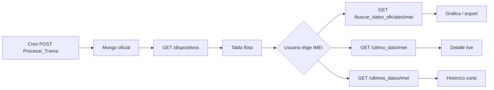

# StarCool — API de datos (`/Starcool`)

Documentación para consumir las rutas StarCool desde frontend, integraciones o cron jobs.

**Prefijo base:** `/Starcool`  
**Registro en app:** `app/server/app.py` → `prefix="/Starcool"`  
**Código:** `app/server/routes/starcool.py` · `app/server/functions/starcool.py`

---

## Convenciones generales

### Envelope de respuesta

Todas las rutas GET usan el mismo formato que TermoKing:

```json
{
  "data": { ... },
  "code": 200,
  "message": "Texto descriptivo"
}
```

Error:

```json
{
  "error": "detalle",
  "code": 400,
  "message": "Texto para el usuario"
}
```

### Zona horaria

- Los datos en Mongo se guardan **sin tzinfo**, interpretados como **GMT-5**.
- La API **no convierte** `created_at` de cada registro: se devuelve tal cual está en BD (string ISO naive, ej. `"2026-08-10T18:57:06.801000"`).
- En búsquedas por rango, `fecha_inicial` y `fecha_final` de la respuesta incluyen offset `-05:00`.
- El resumen de lista indica `"zona_horaria": "GMT-5"`.

### Colecciones Mongo (referencia)

| Uso | Nombre de colección |
|---|---|
| Dispositivos activos del mes | `S_dispositivos_{MM}_{YYYY}` |
| Tramas crudas por IMEI | `S_{imei}_{MM}_{YYYY}` |
| Datos decodificados oficiales | `{imei}_STARCOOL_OFICIAL_{año}` |
| Control de procesamiento | `dispositivos_STARCOOL_OFICIAL_OK` |

Ejemplo: `866262036801750_STARCOOL_OFICIAL_2026` — campo de tiempo: **`created_at`**.

---

## Resumen de rutas

| Método | Ruta | Propósito |
|---|---|---|
| POST | `/Starcool/Procesar_Trama_Starcool/` | Procesar lote de tramas (backend/cron) |
| GET | `/Starcool/dispositivos/` | Lista general + último dato por IMEI |
| GET | `/Starcool/ultimo_estado_dispositivos/` | Alias de `/dispositivos/` |
| GET | `/Starcool/buscar_datos_oficiales/{imei}` | Histórico por IMEI y rango de fechas |
| GET | `/Starcool/ultimo_dato/{imei}` | Un solo registro: el más reciente |
| GET | `/Starcool/ultimos_datos/{imei}` | Últimos N registros (default 10) |

---

## 1. POST `/Starcool/Procesar_Trama_Starcool/`

**Uso:** job periódico que decodifica tramas crudas y llena las colecciones oficiales.

### Body (JSON, todos opcionales)

```json
{
  "limit": 100,
  "start_date": "0",
  "end_date": "0"
}
```

| Campo | Default | Descripción |
|---|---|---|
| `limit` | `100` | Máximo de tramas **por dispositivo** por ejecución |
| `start_date` | `"0"` | Override manual inicio (`dd-mm-YYYY_HH-MM-SS`). `"0"` = automático |
| `end_date` | `"0"` | Override manual fin. `"0"` = sin tope |

**No se envía IMEI.** Los equipos se leen de `S_dispositivos_{MM}_{YYYY}` (mes/año GMT-5).

### Flujo interno

1. Lista dispositivos `estado=1`, `tipo=Starcool`.
2. Por cada IMEI, lee hasta `limit` tramas de `S_{imei}_{MM}_{YYYY}`.
3. Sin registro previo en OK → desde **día 1 del mes 00:00** GMT-5.
4. Con registro → solo tramas con `fecha > hasta`.
5. Inserta en `{imei}_STARCOOL_OFICIAL_{año}` y actualiza `dispositivos_STARCOOL_OFICIAL_OK`.

### Respuesta (sin envelope estándar)

```json
{
  "periodo": "08_2026",
  "mes": "08",
  "anio": 2026,
  "coleccion_dispositivos": "S_dispositivos_08_2026",
  "coleccion_control": "dispositivos_STARCOOL_OFICIAL_OK",
  "dispositivos_encontrados": 82,
  "dispositivos_atendidos": 82,
  "limit_por_dispositivo": 100,
  "total_procesados": 8200,
  "total_fallidos": 12,
  "detalle": [
    {
      "imei": "866262036801750",
      "coleccion_origen": "S_866262036801750_08_2026",
      "coleccion_destino": "866262036801750_STARCOOL_OFICIAL_2026",
      "procesados": 100,
      "fallidos": 0,
      "hasta": "2026-08-10T18:57:06.801000",
      "ultimo_dato": { "...": "..." }
    }
  ]
}
```

---

## 2. GET `/Starcool/dispositivos/`

**Uso:** pantalla principal / tabla de flota StarCool.

Equivalente de formato a `app/server/routes/lista_ejemplo.md`.

### Parámetros

Ninguno.

### Origen de datos

- Lista de IMEIs: `dispositivos_STARCOOL_OFICIAL_OK` (periodo actual GMT-5, `estado=1`).
- Último dato enriquecido: colección `{imei}_STARCOOL_OFICIAL_{año}` (último `created_at`).

### Respuesta

```json
{
  "data": {
    "resumen": {
      "total_dispositivos": 82,
      "online": 55,
      "wait": 9,
      "offline": 18,
      "en_defrost": 7,
      "power_on": 76,
      "power_off": 0,
      "zona_horaria": "GMT-5"
    },
    "dispositivos": [
      {
        "imei": "866262036801750",
        "estado_conexion": "online",
        "ultima_actualizacion": "2026-08-10T18:57:06.801000",
        "minutos_desde_ultimo_dato": 1.3,
        "power_state_texto": "on",
        "en_rango": true,
        "en_defrost": false,
        "ultimo_dato": {
          "temp_supply_1": -0.5,
          "return_air": 0.75,
          "evaporation_coil": 0.5,
          "condensation_coil": 0,
          "compress_coil_1": null,
          "co2_reading": 25.5,
          "o2_reading": 25.5,
          "cargo_1_temp": 128,
          "cargo_2_temp": 128,
          "cargo_3_temp": 128,
          "cargo_4_temp": 128,
          "power_kwh": 0,
          "numero_alarma": null,
          "sp_ethyleno": 0,
          "set_point_o2": 0,
          "set_point_co2": 0,
          "power_state": 1,
          "capacity_load": 0,
          "telemetria_id": 15833,
          "created_at": "2026-08-10T18:57:06.801000",
          "longitud": 0,
          "latitud": 0,
          "set_point": 0
        }
      }
    ]
  },
  "code": 200,
  "message": "Lista de dispositivos StarCool recuperada correctamente."
}
```

### Reglas de `estado_conexion` (GMT-5)

| Estado | Condición (`minutos_desde_ultimo_dato`) |
|---|---|
| `online` | ≤ 30 min |
| `wait` | > 30 min y ≤ 24 h |
| `offline` | > 24 h o sin dato |

### Otros campos calculados

| Campo | Regla |
|---|---|
| `power_state_texto` | `"on"` si `power_state == 1`, si no `"off"` |
| `en_rango` | `true` si `\|return_air - set_point\| ≤ 5` |
| `en_defrost` | evaporador 12–30 °C y supply/retorno cerca del setpoint |

---

## 3. GET `/Starcool/ultimo_estado_dispositivos/`

**Uso:** mismo payload que `/dispositivos/`. Existe por compatibilidad con el patrón TermoKing (`/TermoKing/ultimo_estado_dispositivos/`).

---

## 4. GET `/Starcool/buscar_datos_oficiales/{imei}`

**Uso:** gráficas, exportación, detalle histórico de un equipo.

Equivalente de formato a `app/server/routes/resultado_imei.md`.

### Path

| Parámetro | Ejemplo |
|---|---|
| `imei` | `866262036801750` |

### Query (opcionales)

| Parámetro | Formato | Descripción |
|---|---|---|
| `fecha_inicial` | `YYYY-MM-DD_HH-MM-SS` o `DD-MM-YYYY_HH-MM-SS` | Inicio del rango |
| `fecha_final` | idem | Fin del rango |

**Sin fechas:** últimas **12 horas** GMT-5 respecto a ahora.

### Ejemplos de llamada

```http
GET /Starcool/buscar_datos_oficiales/866262036801750
GET /Starcool/buscar_datos_oficiales/866262036801750?fecha_inicial=2026-08-10_06-00-00&fecha_final=2026-08-10_19-00-00
GET /Starcool/buscar_datos_oficiales/866262036801750?fecha_inicial=10-08-2026_06-00-00&fecha_final=10-08-2026_19-00-00
```

### Respuesta exitosa

```json
{
  "data": {
    "imei": "866262036801750",
    "fecha_inicial": "2026-08-10T06:59:45.086776-05:00",
    "fecha_final": "2026-08-10T18:59:45.086804-05:00",
    "total_datos": 333,
    "datos": [
      {
        "id": 4177324,
        "set_point": 0,
        "temp_supply_1": -0.5,
        "return_air": 0.75,
        "created_at": "2026-08-10T18:57:06.801000",
        "telemetria_id": 15833,
        "...": "resto de campos oficiales"
      }
    ]
  },
  "code": 200,
  "message": "Datos oficiales recuperados correctamente."
}
```

- `datos[]` ordenado por **`created_at` descendente** (más reciente primero).
- Cada elemento es el documento completo de `{imei}_STARCOOL_OFICIAL_{año}`.

### Respuestas alternativas

| Caso | code | message |
|---|---|---|
| Rango válido pero vacío | 200 | `"Sin datos en el rango solicitado."` |
| Fecha mal formateada | 400 | `"Formato de fecha inválido."` |

---

## 5. GET `/Starcool/ultimo_dato/{imei}`

**Uso:** tarjeta de detalle, widget live de un solo equipo.

### Path

`imei` — identificador del dispositivo.

### Respuesta exitosa

Un **objeto** (no array) con todos los campos oficiales del registro más reciente:

```json
{
  "data": {
    "id": 4177324,
    "imei": "866262036801750",
    "set_point": 0,
    "temp_supply_1": -0.5,
    "created_at": "2026-08-10T18:57:06.801000",
    "...": "..."
  },
  "code": 200,
  "message": "Último dato recuperado correctamente."
}
```

### Sin datos

```json
{
  "error": "Sin datos",
  "code": 404,
  "message": "No hay registros oficiales para IMEI 866262036801750."
}
```

---

## 6. GET `/Starcool/ultimos_datos/{imei}`

**Uso:** mini-histórico reciente (tabla compacta, sparkline, diagnóstico).

### Path

`imei` — identificador del dispositivo.

### Query

| Parámetro | Default | Rango | Descripción |
|---|---|---|---|
| `limit` | `10` | 1–100 | Cantidad de registros |

### Ejemplo

```http
GET /Starcool/ultimos_datos/866262036801750?limit=10
```

### Respuesta

```json
{
  "data": {
    "imei": "866262036801750",
    "total": 10,
    "datos": [
      { "id": 4177324, "created_at": "2026-08-10T18:57:06.801000", "...": "..." },
      { "id": 4177315, "created_at": "2026-08-10T18:55:54.896000", "...": "..." }
    ]
  },
  "code": 200,
  "message": "Últimos datos procesados recuperados correctamente."
}
```

Orden: **`created_at` descendente**.

---

## Flujo recomendado para el consumidor



1. **Cron** (cada X minutos): `POST /Procesar_Trama_Starcool/` con `{ "limit": 100 }`.
2. **Dashboard:** `GET /dispositivos/` para tabla con resumen online/wait/offline.
3. **Detalle equipo:**
   - Live: `GET /ultimo_dato/{imei}`
   - Histórico default 12 h: `GET /buscar_datos_oficiales/{imei}`
   - Histórico custom: mismo endpoint con `fecha_inicial` / `fecha_final`
   - Últimos puntos: `GET /ultimos_datos/{imei}?limit=10`

---

## Campos principales en documentos oficiales

| Campo | Descripción |
|---|---|
| `id` | Secuencia incremental del procesamiento |
| `created_at` | Timestamp de la trama (GMT-5 naive) |
| `set_point` | Setpoint temperatura |
| `temp_supply_1` / `temp_supply_2` | Sensores suministro |
| `return_air` | Aire retorno |
| `evaporation_coil` | Evaporador |
| `ambient_air` | Ambiente |
| `cargo_1_temp` … `cargo_4_temp` | Sensores USDA / carga |
| `co2_reading` / `o2_reading` | Lecturas atmósfera |
| `set_point_co2` / `set_point_o2` | Setpoints atmósfera |
| `relative_humidity` / `humidity_set_point` | Humedad |
| `power_state` | 1 = ON, otro = OFF |
| `telemetria_id` | ID legacy (puede ser null en registros nuevos) |
| `numero_alarma` | Alias de `alarm_present` en respuestas |

Valor `128` en sensores USDA suele indicar lectura inválida / placeholder del protocolo.

---

## Archivos relacionados

| Archivo | Contenido |
|---|---|
| `incorporacion_starcool.md` | Lógica de ingesta y colecciones |
| `app/server/routes/lista_ejemplo.md` | Referencia JSON lista dispositivos |
| `app/server/routes/resultado_imei.md` | Referencia JSON búsqueda por IMEI |
| `app/server/models/starcool.py` | Schemas Pydantic (`ProcesoStarcoolSchema`, `ResponseModel`) |
